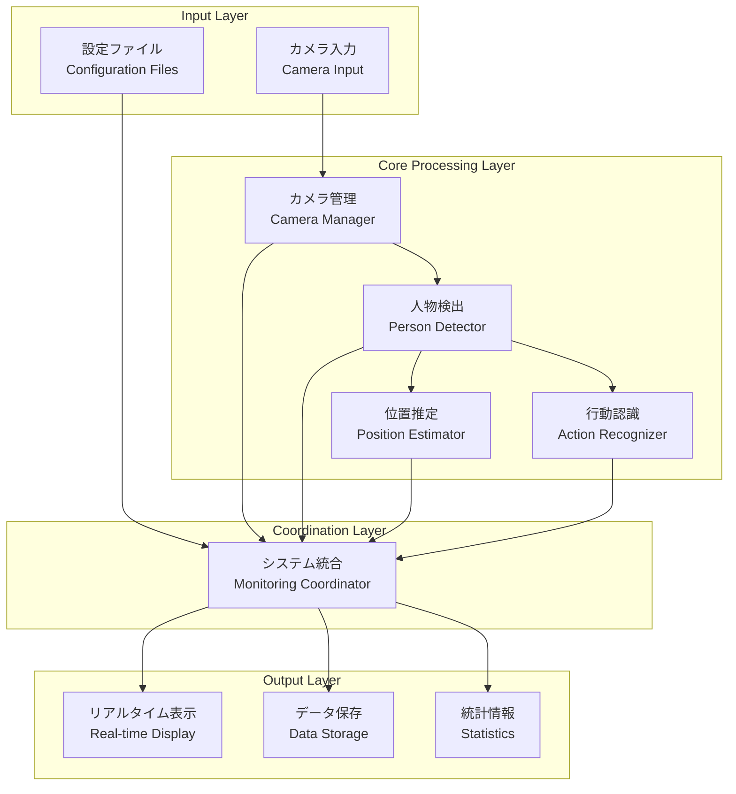
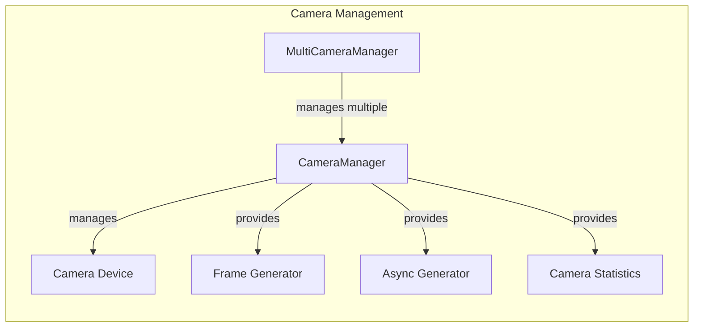
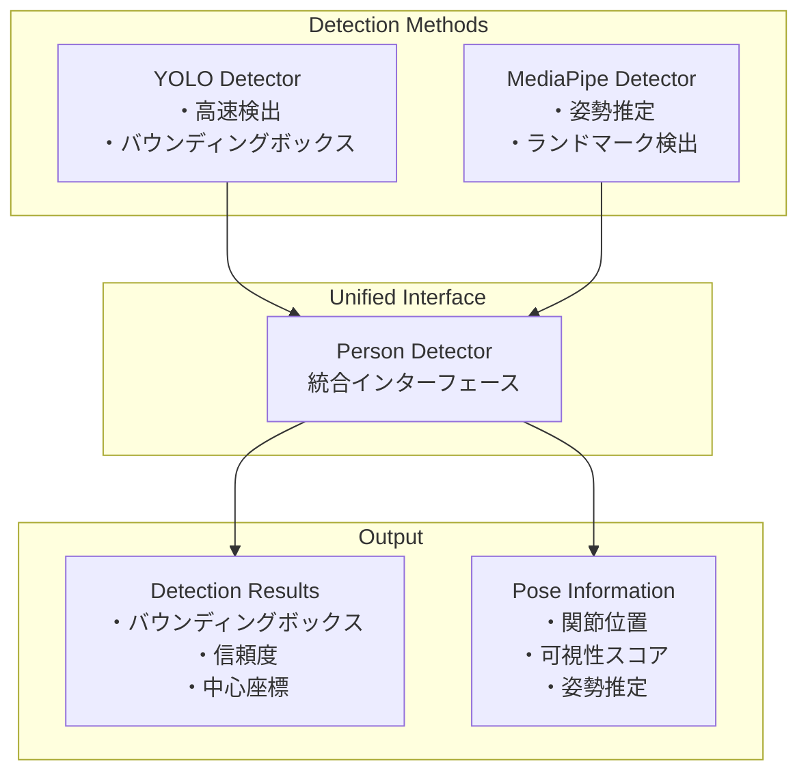
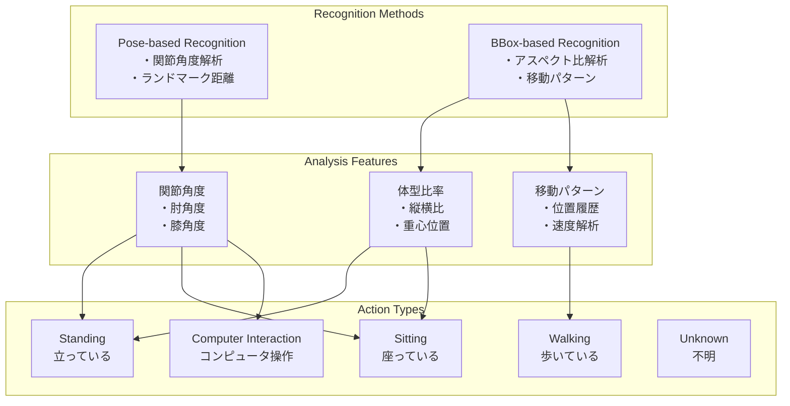
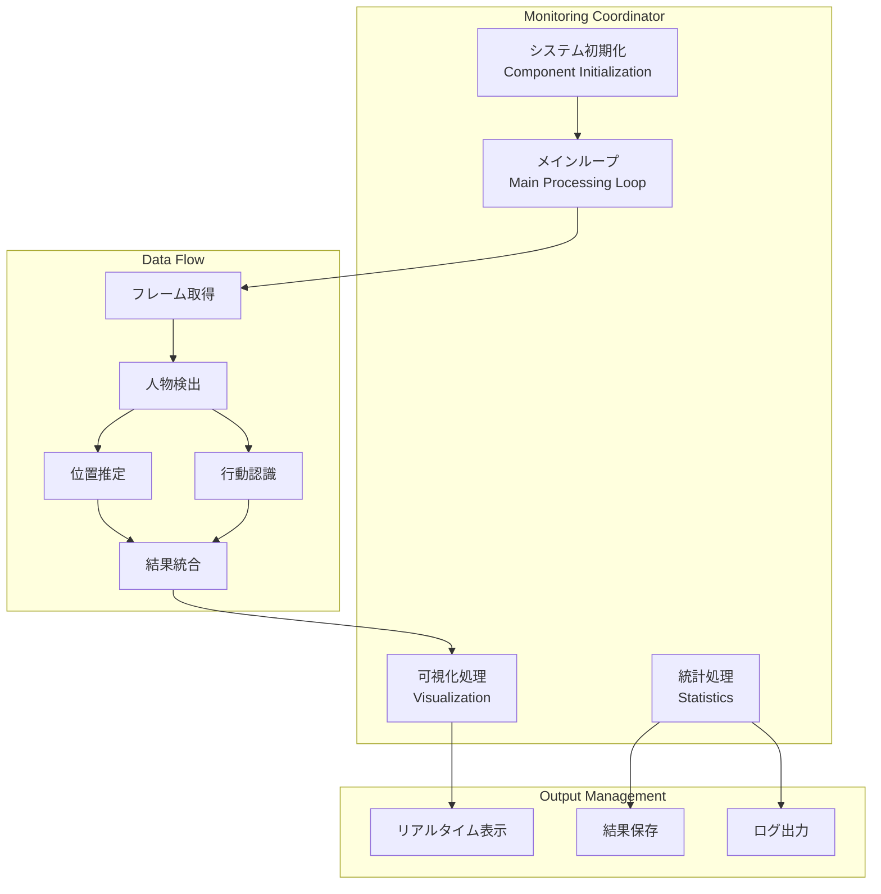
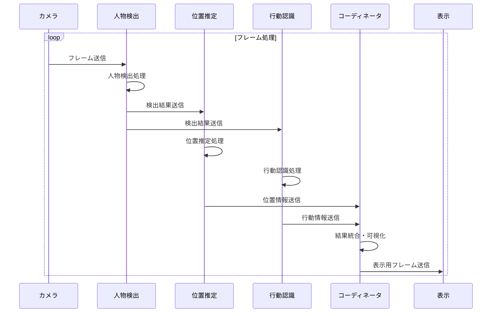
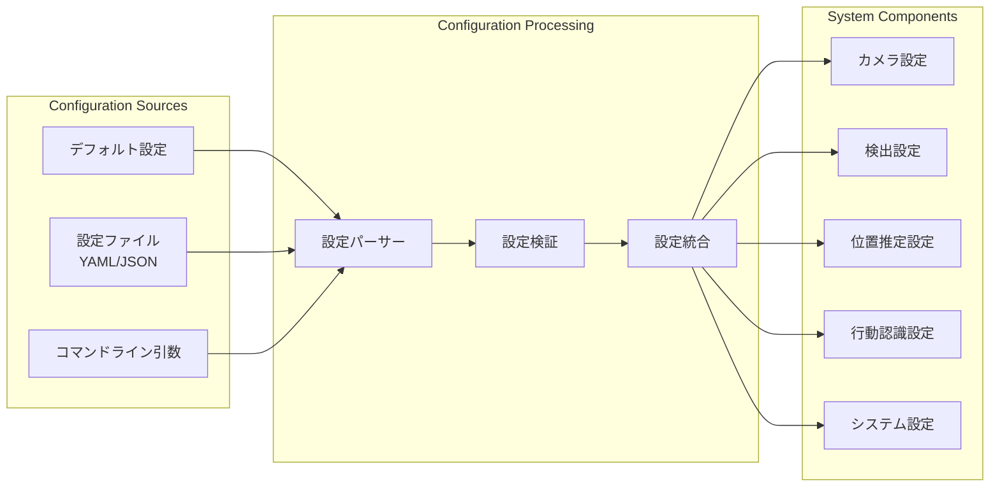
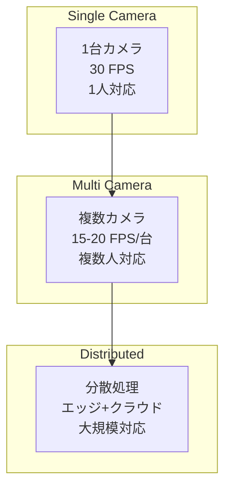
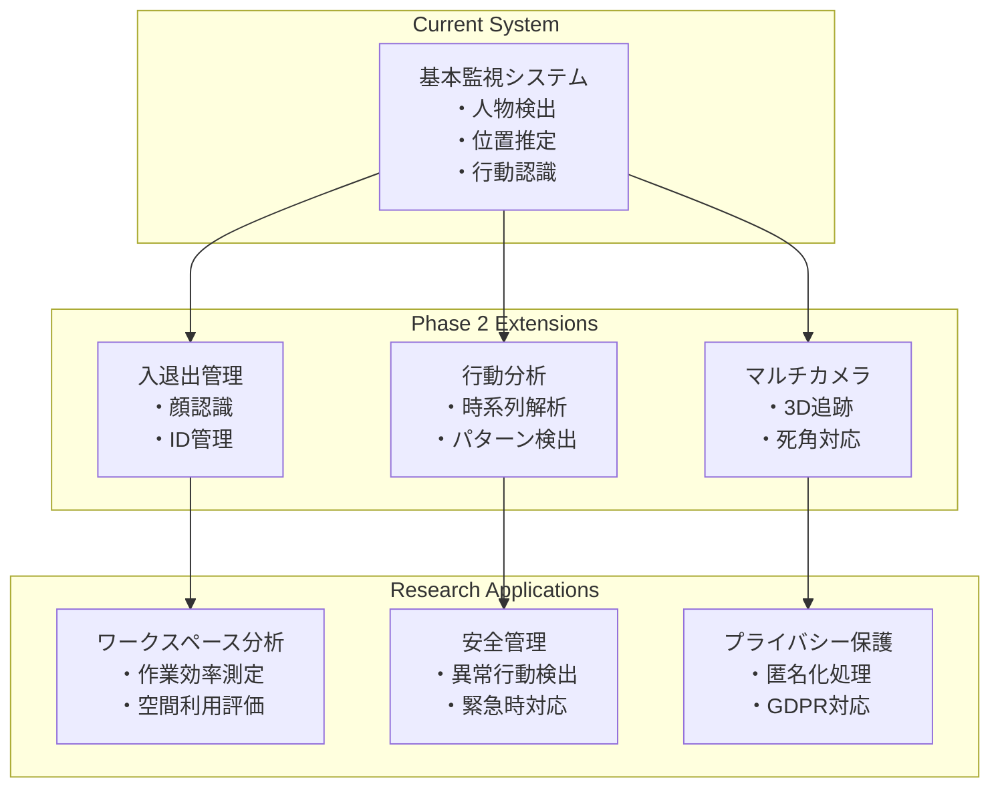

# システム構成図 - 研究室向けカメラベース監視システム
# System Architecture - Laboratory Camera-based Monitoring System

## システム概要

本システムは、研究室環境における人物の検出、位置推定、行動認識を統合的に行うモジュラー設計のカメラベース監視システムです。

## 全体アーキテクチャ



## モジュール詳細構成

### 1. カメラ管理層 (Camera Management Layer)



**主要機能:**
- カメラデバイスの初期化と管理
- フレーム取得とバッファリング
- 複数カメラの同期管理
- 統計情報の収集

### 2. 人物検出層 (Person Detection Layer)



**検出方法比較:**

| 方法 | 精度 | 速度 | GPU要件 | 出力情報 |
|------|------|------|---------|----------|
| YOLO | 高 | 高 | 推奨 | バウンディングボックス |
| MediaPipe | 中 | 中 | 不要 | 姿勢ランドマーク |

### 3. 位置推定層 (Position Estimation Layer)

```mermaid
graph TB
    subgraph "Position Methods"
        BBox[BBox Center<br/>・最も軽量<br/>・基本的な精度]
        Perspective[Perspective Mapping<br/>・高精度<br/>・要較正]
        Depth[Depth Estimation<br/>・中程度精度<br/>・人物サイズベース]
    end
    
    subgraph "Room Coordinate System"
        Room[Room Dimensions<br/>4m × 3m × 2.5m]
        Coordinates[座標系<br/>X: 左壁からの距離<br/>Y: 前壁からの距離]
    end
    
    subgraph "Output"
        Position[Room Position<br/>・X, Y座標 (メートル)<br/>・信頼度<br/>・タイムスタンプ]
        OccupancyMap[占有マップ<br/>・10cm解像度<br/>・密度情報]
    end
    
    BBox --> Position
    Perspective --> Position
    Depth --> Position
    Room --> Coordinates
    Position --> OccupancyMap
```

**位置推定方法比較:**

| 方法 | 精度 | 較正要件 | 計算負荷 | 適用場面 |
|------|------|----------|----------|----------|
| BBox Center | 低 | 不要 | 軽量 | 基本的な位置把握 |
| Perspective Mapping | 高 | 必要 | 中 | 正確な位置測定 |
| Depth Estimation | 中 | 不要 | 中 | バランス重視 |

### 4. 行動認識層 (Action Recognition Layer)



**行動認識アルゴリズム:**

1. **Standing (立位)**
   - 肩と腰の垂直距離 > 閾値
   - 足首が腰より下
   - アスペクト比 > 2.0

2. **Sitting (座位)**
   - 肩と腰の距離 < 閾値
   - 膝が腰より上
   - アスペクト比 < 1.5

3. **Computer Interaction (PC操作)**
   - 両手首の距離 < 閾値
   - 肘角度 60-120度
   - 座位姿勢との組み合わせ

4. **Walking (歩行)**
   - 位置履歴での移動検出
   - 足の非対称配置
   - 継続的な位置変化

### 5. システム統合層 (System Coordination Layer)



## データフロー

### リアルタイム処理フロー



### 設定管理フロー



## パフォーマンス特性

### 処理時間分析

| コンポーネント | 処理時間 (ms) | CPU使用率 | GPU使用率 |
|----------------|---------------|-----------|-----------|
| カメラ取得 | 1-5 | 低 | - |
| YOLO検出 | 10-50 | 中 | 高 |
| MediaPipe検出 | 15-30 | 中 | 低 |
| 位置推定 | 1-5 | 低 | - |
| 行動認識 | 5-15 | 低 | - |
| 可視化 | 5-10 | 低 | - |

### スケーラビリティ



## 拡張性設計

### モジュール拡張ポイント

1. **新しい検出アルゴリズム**
   - `DetectionMethod` Enumに追加
   - 新しい検出クラスを実装
   - `PersonDetector`に統合

2. **新しい位置推定方法**
   - `PositionMethod` Enumに追加
   - 新しい推定クラスを実装
   - `PositionEstimator`に統合

3. **新しい行動タイプ**
   - `ActionType` Enumに追加
   - 認識ロジックを追加
   - 可視化対応を追加

4. **データ保存形式**
   - 新しい出力フォーマット
   - データベース連携
   - クラウド保存

### 研究応用展開



この設計により、研究目的での柔軟な拡張と各手法の精度評価・比較研究が可能となります。